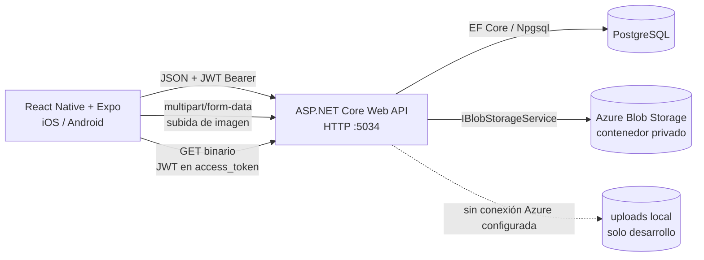

# ReportU — Documentación técnica del MVP

## 1. Propósito y alcance

ReportU es una aplicación móvil para que estudiantes publiquen incidencias, quejas y temas de discusión de su comunidad universitaria. El MVP incluye registro e inicio de sesión, feed, detalle de publicaciones, imágenes, comentarios, apoyos, guardados y edición/eliminación por el autor. No incluye moderación, cuentas administrativas, notificaciones push ni recuperación de contraseña.

Este documento describe el código disponible en `api/` y `front/` y la matriz `docs/qa/mvp-test-cases.md`. La matriz enumera 15 casos, pero ninguno está marcado como ejecutado; por ello, el estado de QA que se reporta aquí es **pendiente**, no aprobado ni fallido.

## 2. Arquitectura

### Cliente móvil

- React Native 0.86 y Expo SDK 57. `App.js` organiza los flujos de autenticación y las pestañas Inicio, Crear, Guardados y Perfil; detalle, edición y visor de imagen se abren dentro de sus stacks.
- `src/api.js` centraliza las solicitudes HTTP, serialización JSON, `ApiError`, JWT, persistencia de sesión y carga multipart. La sesión (`accessToken`, expiración y usuario) se conserva en AsyncStorage. Al iniciar, el proveedor restaura el token y actualiza el perfil.
- `expo-image-picker` solicita permisos de cámara o galería. El formulario crea primero la publicación y después envía cada imagen por separado. La subida multipart usa `XMLHttpRequest` para admitir el formato de archivo `{ uri }` de React Native.
- Las llamadas autenticadas envían `Authorization: Bearer {token}`. Como el componente nativo `<Image>` no permite adjuntar headers, las URLs de imagen llevan `?access_token=...`; el servidor solo acepta ese mecanismo bajo `/api/media`.

### API y almacenamiento

- ASP.NET Core 10 expone controladores JSON y Swagger en `/swagger`; escucha en `http://0.0.0.0:5034`. JWT protege todos los endpoints salvo registro e inicio de sesión.
- EF Core con Npgsql persiste usuarios, publicaciones, metadatos de imágenes, comentarios, apoyos y guardados en PostgreSQL. La API configura timestamps UTC y los contadores de comentarios/apoyos usados por el feed.
- Azure Blob Storage guarda el binario de cada imagen. PostgreSQL conserva el metadato y la clave del blob, no el archivo. El contenedor Azure se crea/verifica al arrancar cuando hay conexión configurada; el acceso de lectura de los blobs es privado y la API transmite el binario al cliente.
- Si `AzureBlob__ConnectionString` está vacía, se selecciona `LocalFileStorageService` y se guardan archivos bajo `uploads/`. Es un modo de desarrollo, no Azure ni almacenamiento recomendado para producción.
- `ExceptionHandlingMiddleware` traduce errores de dominio y excepciones a `application/problem+json`, con `code` y `traceId`. Los enums se serializan como cadenas legibles.

### Configuración y ejecución local

1. Copiar `api/.env.example` a `api/.env` y configurar la conexión PostgreSQL, una clave JWT de al menos 32 caracteres y, para probar Azure real, la cadena de conexión y el contenedor. No versionar el `.env` ni usar la clave de desarrollo en producción.
2. Desde `api/`, ejecutar `podman compose up -d` para PostgreSQL.
3. Aplicar migraciones con `dotnet ef database update` (requiere `dotnet-ef` 10) y arrancar con `dotnet run`. La API queda disponible en el puerto 5034 y Swagger en `http://localhost:5034/swagger`.
4. Desde `front/`, instalar dependencias con `npm install`, definir `EXPO_PUBLIC_API_URL` en `front/.env` para el dispositivo elegido y arrancar con `npm start`. Usar `http://localhost:5034` en simulador iOS, `http://10.0.2.2:5034` en emulador Android o la IP LAN del equipo para un teléfono físico. Reiniciar Expo tras cambiar la variable.

## 3. Contrato HTTP principal

Las rutas protegidas requieren `Authorization: Bearer {accessToken}`. Los errores de validación, autenticación y dominio usan JSON Problem Details con, como mínimo, `status`, `title`, `detail`, `code` y `traceId`. `ApiError` expone `status`, `code` y errores de validación a la interfaz.

### Autenticación

| Método y ruta | Acceso | Solicitud | Respuesta correcta |
|---|---|---|---|
| `POST /api/auth/register` | Público | `email`, `password`, `username`, `fullName`, `career`, `enrollmentNumber` | `201 Created`; `accessToken`, `tokenType: "Bearer"`, `expiresAt`, `user` |
| `POST /api/auth/login` | Público | `identifier` (email o username), `password` | `200 OK`; mismo contrato de token y usuario |

Registro exige email válido, contraseña de 8–100 caracteres, username de 3–30 caracteres (`letras`, números, `_` o `.`) y los datos de perfil requeridos. Email y username duplicados responden `409 Conflict` (`email_taken` o `username_taken`); validación `400`; credenciales incorrectas en login `401` (`invalid_credentials`). La contraseña se almacena con BCrypt y nunca se devuelve. El token contiene identidad del usuario y tiene duración configurable. No hay refresh token: cerrar sesión elimina el token local.

### Publicaciones

| Método y ruta | Acceso | Respuesta correcta y comportamiento |
|---|---|---|
| `GET /api/posts?sort=recent&page=1&pageSize=20` | JWT | `200 OK`; `{ items, page, pageSize, totalCount, totalPages }`. `sort=recent` ordena por fecha descendente; `sort=popular` por apoyos descendentes. `pageSize`: 1–50. |
| `GET /api/posts/{id}` | JWT | `200 OK`; detalle con descripción, imágenes, autor, contadores y estado de apoyo/guardado del usuario. `404` si no existe. |
| `POST /api/posts` | JWT | `201 Created`; detalle de la publicación recién creada. Las imágenes se agregan con el endpoint de media. |
| `PATCH /api/posts/{id}` | JWT, solo autor | `200 OK`; detalle actualizado. Acepta campos parciales: título, descripción, tipo, categoría, ubicación y modo de identidad. `403` para otro usuario; `404` si no existe. |
| `DELETE /api/posts/{id}` | JWT, solo autor | `204 No Content`. Elimina publicación y datos relacionados; intenta purgar los blobs asociados (ver nota de borrado). `403` para otro usuario; `404` si no existe. |
| `GET /api/posts/{id}/comments` | JWT | `200 OK`; lista de comentarios ordenada cronológicamente. `404` si el post no existe. |
| `POST /api/posts/{id}/comments` | JWT | Solicitud `{ "body": "..." }`; `201 Created` con `{ id, body, author, createdAt }`. Texto máximo 1000 caracteres. |
| `PUT /api/posts/{id}/support` | JWT | `200 OK`; `{ supportCount, supportedByMe: true }`. Un apoyo por usuario/post; repetir responde `409` (`already_supported`). |
| `DELETE /api/posts/{id}/support` | JWT | `200 OK`; contador actualizado y `supportedByMe: false`. Si no había apoyo, `404` (`not_supported`). |
| `PUT /api/posts/{id}/bookmark` / `DELETE /api/posts/{id}/bookmark` | JWT | Guardar/quitar; `200 OK` con `{ bookmarkedByMe }`. Conflictos y ausencia se expresan mediante Problem Details. |

Las respuestas del feed incluyen `id`, `title`, `type`, `category`, `location`, `author`, `supportCount`, `commentCount`, `imageCount`, `coverImage`, `supportedByMe`, `bookmarkedByMe`, `isOwner`, `createdAt` y `updatedAt`. El detalle amplía esos campos con `description` e `images`. La API nunca expone el email en la identidad pública.

### Media e imágenes

| Método y ruta | Acceso | Solicitud/respuesta correcta |
|---|---|---|
| `POST /api/posts/{postId}/images` | JWT, solo autor | `multipart/form-data`, campo `file`; `201 Created` con `{ id, url, downloadUrl, contentType, sizeBytes, createdAt }`. |
| `GET /api/posts/{postId}/images` | JWT | `200 OK`; lista de metadatos de imágenes. |
| `GET /api/media/{imageId}` | JWT | `200 OK`; binario inline con su `Content-Type`. Para `<Image>` el token puede viajar como `access_token` en query string. |
| `GET /api/media/{imageId}/download` | JWT | `200 OK`; archivo original con `Content-Disposition: attachment`. |
| `DELETE /api/media/{imageId}` | JWT, solo autor | `204 No Content`; elimina metadato y blob. |

Se permiten hasta 4 imágenes por post, de hasta 5 MiB cada una y tipos JPEG, PNG, WebP o GIF. Errores relevantes: `400` archivo ausente/vacío, `403` usuario ajeno, `404` recurso inexistente, `409` límite de imágenes (`image_limit_reached`), `413` tamaño excedido (`payload_too_large`) y `415` tipo no permitido (`unsupported_media_type`). Al fallar el borrado individual del blob, el servicio puede devolver `502` (`blob_error`) después de quitar el metadato.

**Consistencia al borrar un post:** el registro de base de datos se elimina y la limpieza de blobs se intenta de forma best-effort; los fallos de Azure se registran en el log y no cambian el `204`. Por tanto, la desaparición del archivo en Azure debe comprobarse directamente para cerrar TC-15; el `204` por sí solo no demuestra borrado físico.

## 4. Resumen y resultados de QA

La fuente es `docs/qa/mvp-test-cases.md`. Sus 15 casillas están vacías: **0 casos reportados como aprobados, 0 reportados como fallidos y 15 pendientes de ejecución/evidencia**. La implementación contiene pantallas y rutas para los flujos indicados, pero la lectura del código no equivale a una prueba ejecutada contra servicios reales.

| Casos | Área | Qué debe verificarse | Estado en la matriz |
|---|---|---|---|
| TC-01–TC-04 | Autenticación | Registro válido; duplicados/campos vacíos; login y persistencia de token; contraseña incorrecta. | Pendiente (4) |
| TC-05–TC-09 | Publicaciones e imágenes | Foto de cámara; selección de galería; subida y URL/metadato; feed con imagen; detalle. | Pendiente (5) |
| TC-10–TC-11 | Interacción social | Segundo usuario comenta y apoya; contador actualizado. | Pendiente (2) |
| TC-12–TC-15 | Edición, permisos y borrado | Autor edita; usuario ajeno no puede; autor elimina y el post desaparece; blob eliminado físicamente. | Pendiente (4) |
| **Total** | | **15 casos sin resultado marcado** | **0 ejecutados en el registro** |

### Lectura técnica de la cobertura

- Auth implementa `201` para registro, `409` para email/username duplicados, `200` para login y `401` para credenciales inválidas. La validación de campos vacíos es del modelo/API y también se valida en la interfaz.
- El formulario soporta cámara y galería. Crear un post y cargar su imagen son solicitudes separadas; si la carga falla, el post permanece creado y la aplicación informa del fallo. TC-07 debe comprobar tanto el objeto en Blob Storage como el metadato en PostgreSQL cuando se use Azure.
- El feed y detalle consumen los endpoints previstos. Comentarios y apoyos también tienen endpoints y actualizan sus contadores; la respuesta del servidor es la fuente final del contador.
- La interfaz solo muestra editar/eliminar al propietario y el API vuelve a validar propiedad con `403`. TC-13 debería intentar la solicitud con el token de otro usuario, no limitarse a observar que el botón está oculto.
- La eliminación del post solicita purga de blobs best-effort; la verificación física requerida por TC-15 no se puede deducir únicamente del estado HTTP.

**Criterio para cerrar QA:** ejecutar cada caso en un entorno identificado (versión de API/app, dispositivo, base y modo de storage), registrar resultado, evidencia y fecha, y usar el storage Azure real para TC-07/TC-15 si la aceptación exige Azure. No marcar como aprobado basándose solo en que exista la ruta en el código.

## 5. Guía de demostración en vivo (5 minutos)

### Preparación previa

- Arrancar PostgreSQL, API y Expo; probar que ambos dispositivos llegan a la URL de API correcta. Tener Swagger abierto en `http://localhost:5034/swagger` como respaldo para inspección.
- Preparar dos cuentas de estudiante distintas, A (autor) y B (interacción), y dos clientes/simuladores conectados a la misma instancia. Mantener A en un cliente y B en el otro evita perder tiempo cambiando sesión.
- Conceder previamente el permiso de cámara/galería y dejar una imagen de prueba accesible en la galería. La galería es el camino más determinista; usar cámara si el entorno permite tomar una foto rápidamente.
- Confirmar que Azure está configurado y que se inspeccionará el contenedor correcto para demostrar TC-15. Sin Azure configurado, la demo usa `uploads/` local y debe presentarse como fallback, no como Azure.
- Para mostrar registro dentro del tiempo, usar una cuenta desechable ya preparada para registrarse antes del ensayo; el flujo principal de cinco minutos empieza con ambas cuentas listas.

### Recorrido cronometrado

| Tiempo | Acción | Resultado visible |
|---|---|---|
| 0:00–0:35 | En el cliente A, iniciar sesión y mostrar el feed Recientes/Populares. | Entrada autenticada al feed; la sesión queda persistida. |
| 0:35–1:45 | Abrir **Crear**; introducir título, descripción y categoría; añadir una imagen de galería (o cámara) y publicar. | Mensaje de publicación, miniatura seleccionada y regreso al inicio. API crea primero el post y luego sube la imagen. |
| 1:45–2:20 | Actualizar feed, abrir la publicación y tocar la imagen. | Publicación e imagen visibles; detalle muestra descripción y contador. |
| 2:20–3:10 | En el cliente B, iniciar sesión y abrir el mismo post; dejar un comentario y pulsar apoyo. | Comentario atribuido a B y contador de apoyos actualizado en el servidor. |
| 3:10–4:00 | En el cliente A, volver a cargar el detalle, entrar a **Editar**, cambiar el título o descripción y guardar. | Cambios del propietario reflejados al volver al feed/detalle. |
| 4:00–5:00 | Desde A, eliminar la publicación y confirmar. Actualizar el feed y consultar Azure Blob Storage. | API responde `204`, post ya no aparece y el blob correspondiente ya no está en el contenedor. Si el blob sigue presente, registrar TC-15 como fallido aunque la API haya devuelto `204`. |

### Plan de contingencia

- Si falla la conexión o carga de imagen, mostrar el error en UI y revisar la solicitud en Swagger/logs; no afirmar éxito de subida.
- Si cámara/galería no concede permisos, continuar con un post sin imagen y clasificar TC-05/TC-06 como no demostrado; repetir esos casos con permisos concedidos.
- Si la limpieza de Azure falla, conservar el identificador/blob name y el log, marcar TC-15 como fallido y retirar manualmente el archivo solo después de guardar evidencia.

## 6. Límites y consideraciones operativas

- Las rutas usan HTTP en la configuración de desarrollo. En un despliegue público se requiere HTTPS, secretos gestionados fuera del repositorio y configuración de orígenes CORS apropiada.
- `access_token` en query string es una solución de compatibilidad del cliente de imágenes y solo se procesa en `/api/media`; al desplegar, evitar registrar URLs completas con tokens.
- El MVP usa JWT sin refresh ni revocación en servidor. El cierre de sesión solo borra la sesión del dispositivo.
- La matriz de QA aún debe ejecutarse y completarse; este documento no sustituye resultados de pruebas funcionales ni verificación de Azure.
